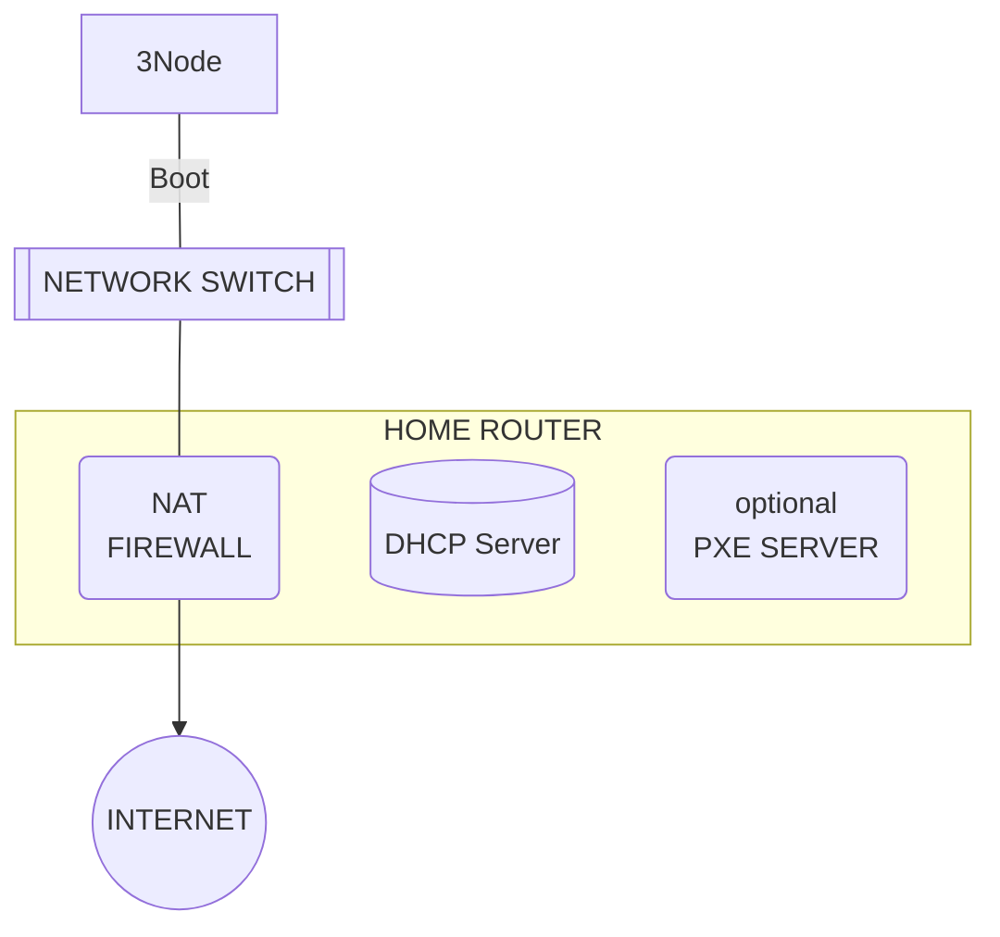

## Network Home or Small Office

a 3Node needs to be connected to a wired network, providing a dhcp server and a default gateway to the Internet, be it NATed or plainly on the public network, where any route to the Internet, be it IPv4 or IPv6 or both is sufficient.

For a node to have that ability to host user networks, we strongly advise to have a working IPv6 setup, as that is the primary IP stack we're using for the User Network's Mesh to function.

One or more nodes can be hosted on the same network.

The ThreeFold device will act as one of you household (office) devices and make se of the available bandwidth to the internet provider by the set-top box.

### requirements

- [ ] 3Node gets ip address from DHCP server which has access to internet
- [ ] Link to the Internet with appropriate bandwith
- [ ] public ip address in case you also want to be a network farmer.