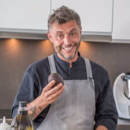

# Dave De Belder

Dave has a culinary/gastronomy background and with this seems like the odd one out in the Grid Council. Through his life, Dave has had many successful businesses. When looking back on this he feels he focussed on the wrong things in life back then and had a materialistic mindset. This changed a lot over the last 5 years. Broadening his horizon and seeing what life is really all about makes him the perfect candidate for the council. Dave, as the odd one out has the voice and opinion that many with lesser technology insight might have and thus is a voice for the many.  This is a task he loves to fulfil with the purest intentions.