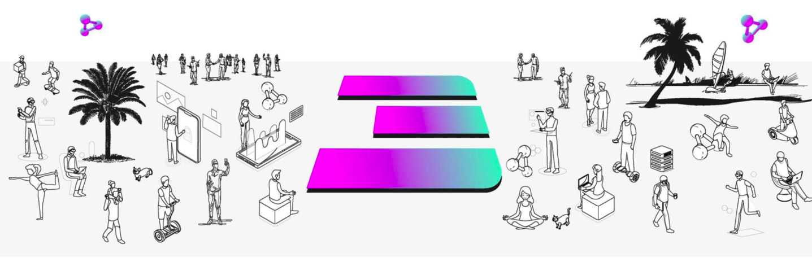

# Be the Internet

We are a decentralized movement. Get involved and let's together **"BE THE INTERNET".**

## Provision a ThreeFold Validator

See [here](validators_faq)

## Buy TFT or Future TFT

ThreeFold_Token is used to reserve and utilize Internet capacity and services on the ThreeFold_Grid. 

Just like Bitcoin decentralized the banking Industry, ThreeFold_Token is decentralizing the Internet. Learn how to buy TFT [here](@how_to_buy).

We also have a created farming token called INCA, contact us for more info. This allows you to get vested more. Buying large amounts of TFT on the public exchanges is hard right now.

## Build on ThreeFold

The ThreeFold_Grid is ready for testing for those with a technical background. Get your hands on the future of the cloud with integrated industry standard tooling operated on our decentralized Internet infrastructure.

You can find more information on how to deploy workloads on the  ThreeFold_Grid with the [Grid 3.0 Manual](@manual:manual3) or our [Developer Community](https://t.me/threefoldtesting).

## Become a ThreeFold Farmer

Become a Farmer by getting a 3Node and connecting it to electricity and network to expand the ThreeFold Grid further. By expanding the ThreeFold Grid to your local region, you're participating in the growth of a decentralized, autonomous and sustainable Internet accessible to everyone. 

By becoming a Farmer, you earn TFT on a monthly basis for generating Internet capacity. Learn more about Farming [here](@farming_intro)

## Join Our List of Partners, Deploy on the Grid

Contact us at info@threefold.io and we will help you to get started.

<!-- There are 40+ solutions waiting to go life in H1 2022. -->

## Contribute to Our Movement

- Help us to add content to our Library, Manual, website ... (You'll need a GitHub account)
- Business Development
- Contribute Code
- Quality Assurance
- Marketing & Communication

<!-- We have TFT grants available, the TFDAO helps to award these grands. -->

Contact us and we will help you to get started.

## Spread the Word

- Join us on Social Media
  - [Twitter](https://twitter.com/threefold_io)
  - [LinkedIn](https://www.linkedin.com/company/threefold-foundation)
  - [Reddit](https://reddit.com/r/threefold)

- Get active on / help us moderate our chats or forum
  - [Main Chat](http://t.me/threefold)
  - [Farmer Chat](https://t.me/threefoldfarmers)
  - [Grid Tester Chat](https://t.me/threefoldtesting)
  - [Forum](https://forum.threefold.io)

<!-- - spread the message 
  - [ThreeFold Images](@threefold_images)
  - [ThreeFold Wallpapers](@threefold_wallpapers)
- help us moderate our forum, chat, ... -->

<!-- ## Get Your Hands Dirty: Offer Support!

If you have the time and would like to get involved in supporting the Foundation, please let us know either on [the forum](https://forum.threefold.io) or by emailing us at info@threefold.io. Based on your background and interests, we'll find a way to get you involved.

## Build Community: Spread the Word!

We have a few places where you can find regular / updated content:

- [Announcement Telegram Channel](https://t.me/threefoldnews)
- [Forum](https://forum.threefold.io)
- [Website](https://threefold.io)
- [Facebook](https://facebook.com/ThreeFold.io)
- [LinkedIn](https://linkedin.com/company/threefold-foundation/)
- [Twitter](https://twitter.com/threefold_io)
- [Blog](https://threefold.io/blog)
- [YouTube](https://youtube.com/c/ThreeFoldFoundation)

Please follow along and feel free to share with your networks when you are inspired to do so. Remember it's always best to add a line of text or two when you share the post rather than just hitting "share now." If you don't know what we're talking about, reach out to spreadtheword@threefold.io and we'll walk you through it.

Additionally, we have [a folder in this section](threefold_images) with shareable content you can simply download and post on your social network or messaging platform of choice.

### Introduce Someone Specific to ThreeFold

While blasting your network might be effective, we'd really recommend thinking about who specifically in your circles would be interested in what we are building, and getting in touch with them one-on-one.

Are you connected with people who want to do good for the planet? Make sure they know about the challenges of today's Internet and the reasons [why we're doing what we're doing](https://consciousinternet.org/about).

Encourage them to follow along and spread the word with their own networks. Do you know developers or IT professionals? Invite them to check out our [peer-to-peer cloud](https://cloud.threefold.io) or join [our testing community](https://t.me/joinchat/BwOvOxxgK59GmRoZ2_sM0w). Have any friends who are journalists or run podcasts? We'd love to talk with them (spreadtheword@threefold.io).

We believe heavily in the network effect. Say for example that there are 5,000 people in our community. If each existing person introduced even just one new person each week to ThreeFold, and then they all did the same the following week, we'd have 80,000 people in our community in one month.

- Week 1: 5,000 existing + 5,000 new = 10,000 total
- Week 2: 10,000 existing + 10,0000 new = 20,000 total
- Week 3: 20,000 existing + 20,000 new = 40,000 total
- Week 4: 40,000 existing + 40,000 new = 80,000 total

You know best how to get in touch with the people in your circles so we'll leave it to you. But again, we're here to help if you're stuck!

### Help Us Form a New Partnership

We believe strongly that partnerships are the way forward. We have built a responsible solution / foundation for conscious organizations. Dozens of organizations have already signed on or expressed their intent to sign on to move to and/or build on top of the ThreeFold_Grid – and we invite more to do the same.

Learn more about our existing ecosystem at:

[ThreeFold Partners](https://farming.threefold.io/partners)
[The Alliance for a Conscious Internet](https://consciousinternet.org)

### Seek Out New Communities

There are many groups on Facebook and LinkedIn, for example, that would and should be interested in what we are building. All it takes is a bit of digging to find them. Once you do, introduce yourself and share a bit about ThreeFold. Tap into what the group or community is all about.

Importantly, PLEASE avoid "spamming" as much as possible (just blasting about ThreeFold without any context, or posting across many groups at the same time). -->