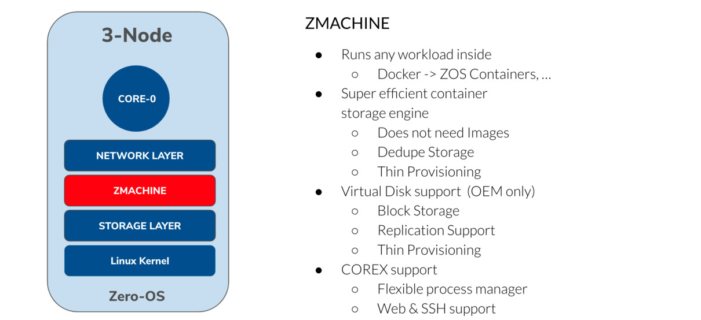

# ZMachine

ThreeFold's compute vmachine technology is fully compatible with docker.

## ZMachine

ThreeFold VMachine technology as implemented in Zero-OS using KVM Hypervisor.

### Features

*   import from docker (market std for containers)
*   integration with [ZNet](znet) (efficient, secure encrypted network between the zmachines)
*   can be easily deployed at the edge
*   integrated with scalable & capable monitoring system (prometheus based)
*   single-tenant!

### ZMachine Benefits

*   [ZOS Protect](zos_protect): no hacking surface to the Zero-Nodes, integrate silicon route of trust
*   [ZOS Filesystem](zos_fs): dedupe, zero-install, hacker-proof
*   [WebGateway](webgw): intelligent connection between web (internet) and container services
*   [ZNet](znet) and [Planetary Net](planetary_network): a true global single backplane network connecting us all

!!!include:zos_toc

!!!def