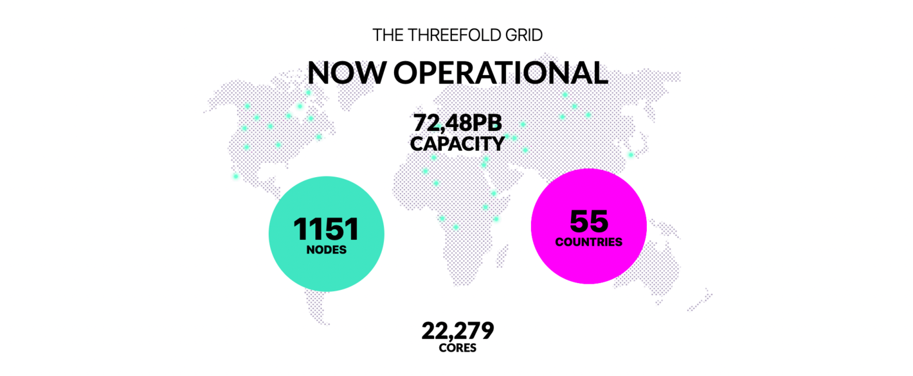

# ThreeFold Grid Capacity Explorer

Thousands of 3Nodes are connected to the ThreeFold Grid across the world. Find the live stats on https://explorer.grid.tf.

The explorer allows you to find:
- Available 3Nodes and web gateways 
- Live statistics about the ThreeFold Grid 
- Live capacity map

Using the `Capacity finder` panel, you can filter out the nodes based on their farm and resource units.

By clicking on a node or a gateway, you get access to a full information view, as shared below. 

The information view lets you inspect a specific node or gateway in more details. Next to basic information (like farm, location, uptime), you can also find the primitives currently provisioned on the node and how much resource is available on the node or gateway.