 
 

# The ThreeFold Grid:

## Different Audiences

Users, developers, and enterprises need TFT to deploy their IT workloads on the TF Grid. Anything which runs on Linux is supported on the TFGrid.

## Cloud

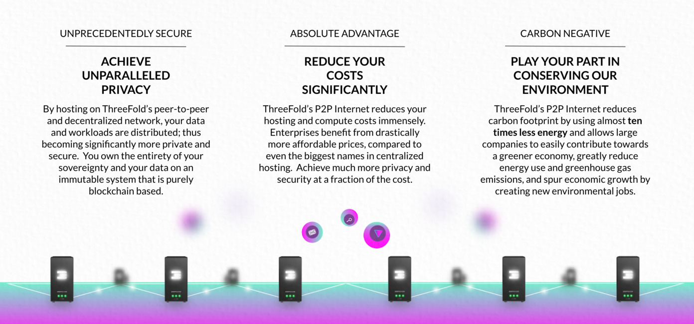

Use the ThreeFold grid as your cloud platform. Any workload which is Linux compatible can run on our Peer2Peer grid.

Benefits

- more local
- decentralized, data sovereign
- green: carbon double win
- powerful

A powerful storage layer.

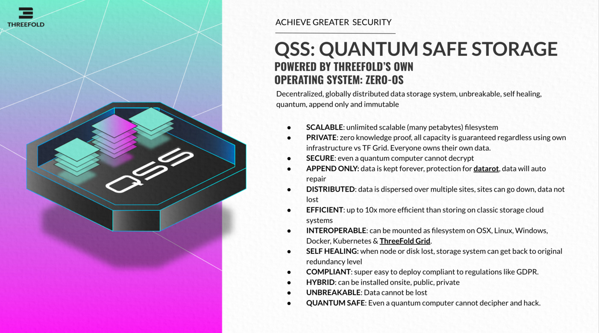

### TFGrid Kubernetes Cloud 

A scalable private cloud that comes with a virtual data center solution, a zstor filesystem and a planetary network. TF P2P Cloud represents the next evolution of cloud and brings the most powerful architecture for IT workloads to scale. 

- Visit TF P2P Cloud wiki [here](cloud_home).

## Blockchain As Service

Most of them will also be part of ThreeFold_Now

- [Digibyte](https://digibyte.io/)
- [Dash](https://www.dash.org/)
- [Skale Labs](https://skale.network/)

> Many more parters are availabe on our TFGrid.

## Internet Solutions

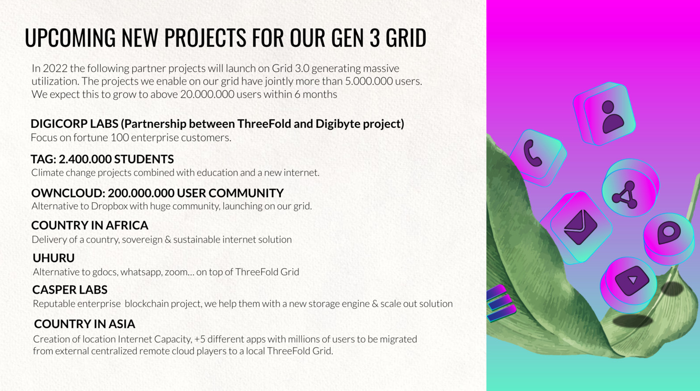

A lot of apps are being deployed/developed on top of the ThreeFold Grid

### Owncloud

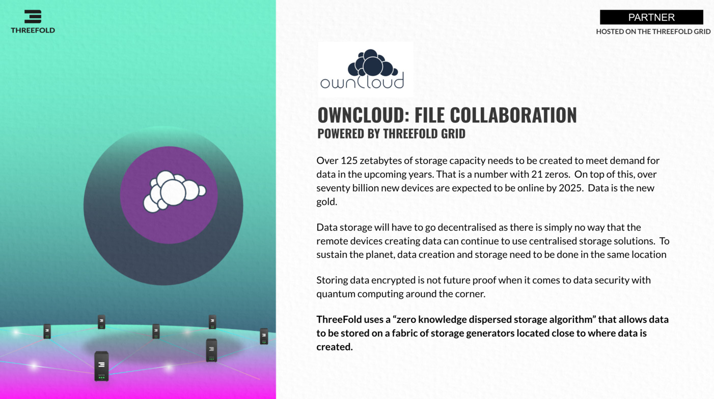

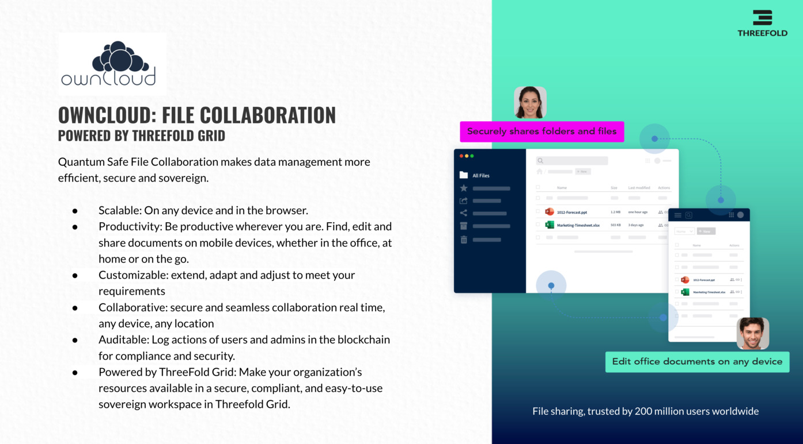

### Filemanager / Office Editor

### Ode

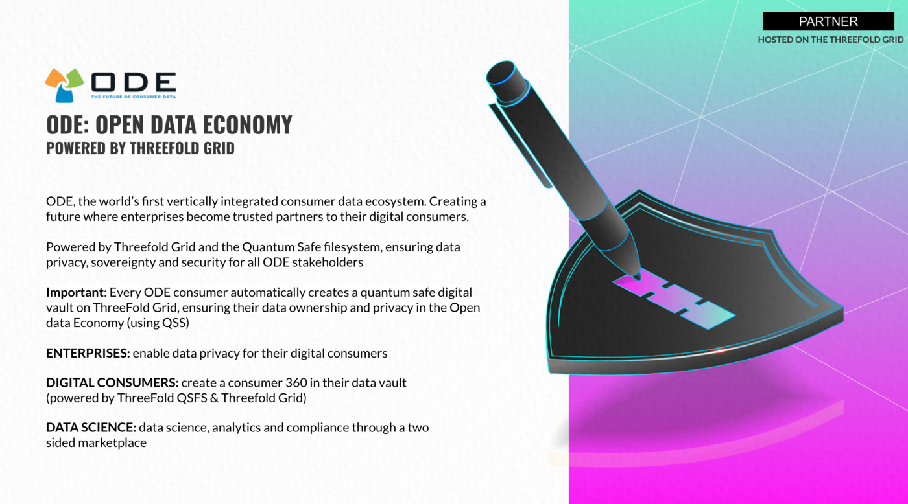

### Zoom Alternative

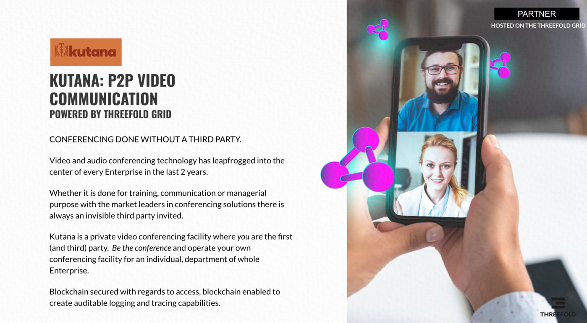

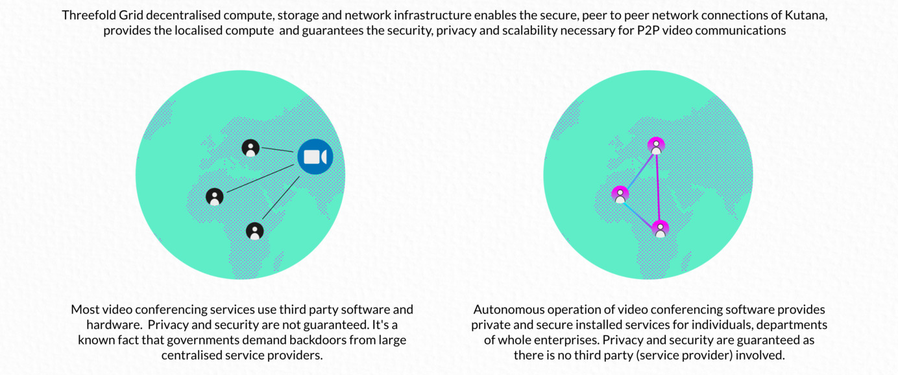

### Web publishing system

### Sovereign Chat System

### Cloud Browser Engine

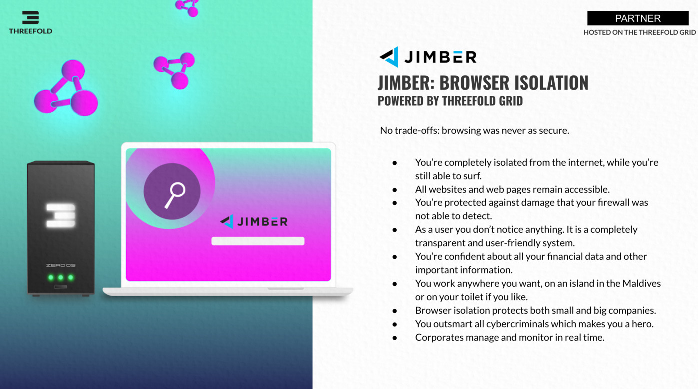
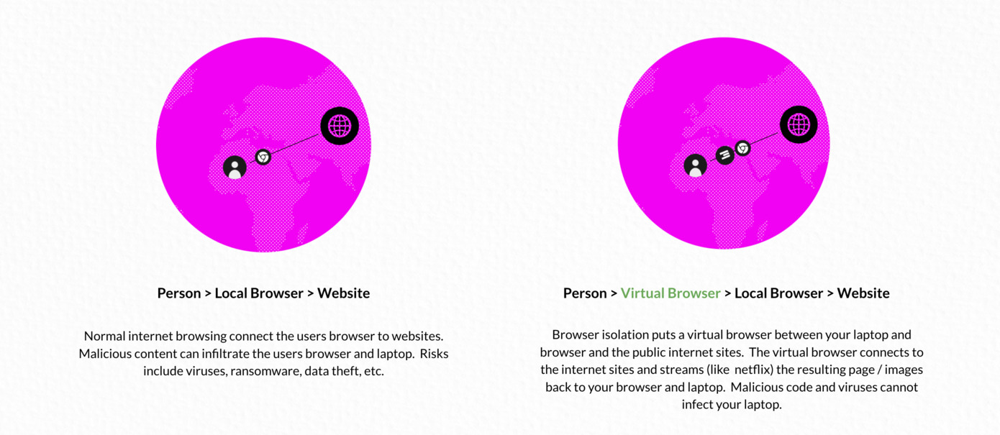

## More To Come

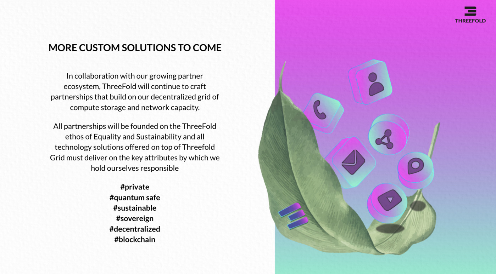

<!-- ## Developers

### 3Bot (test phase)

Use your virtual system administrator to develop, deploy and manage solutions on the ThreeFold Grid. 3Bot brings infinite possibilities to create, build and scale architectures and IT workloads.

This product is meant for real tech experts, only available on TFGrid 2.x right now.
 -->