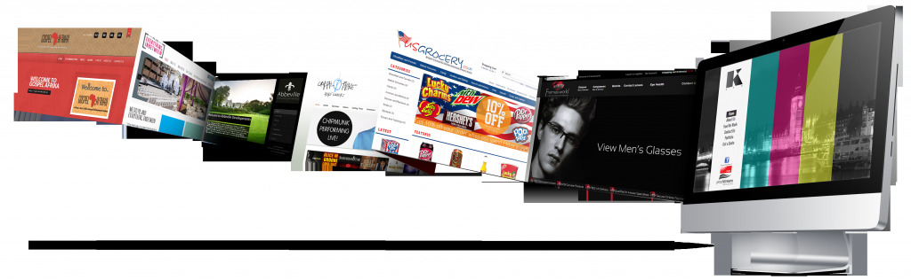
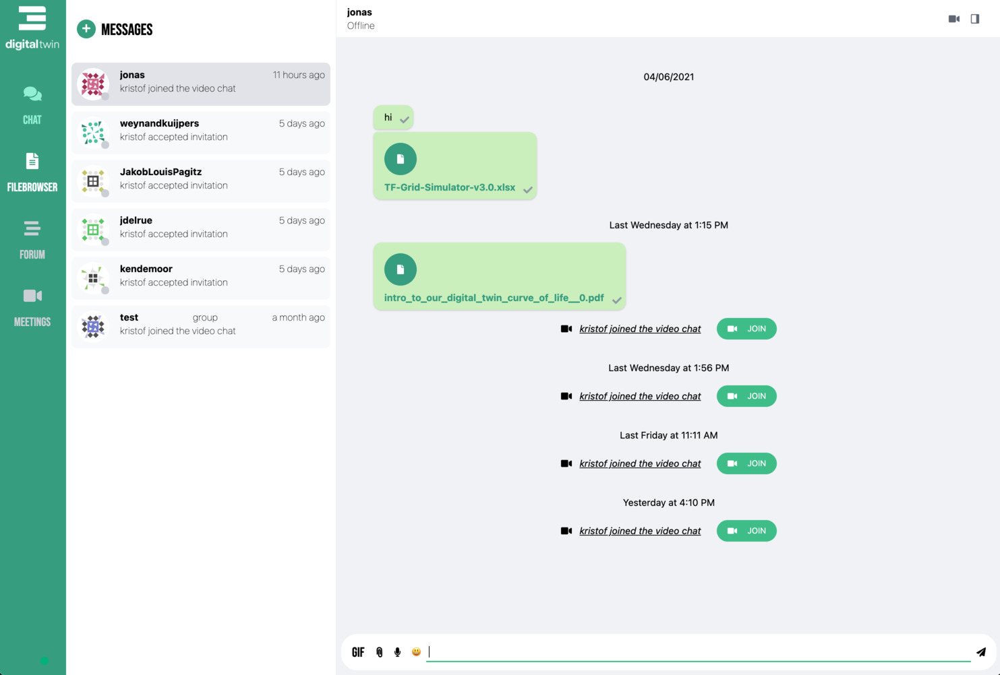

There are many use-cases being built on top of the ThreeFold Grid to use the capacity that is made available by farmers. See below the main products available today.

## Cloud

Use the ThreeFold grid as your cloud platform. Any workload which is Linux compatible can run on our Peer2Peer grid.

Benefits

- more local
- decentralized, data sovereign
- green: carbon double win
- powerful

### TFGrid Kubernetes Cloud (test phase)

A scalable private cloud that comes with a virtual data center solution, a zstor filesystem and a planetary network. TF P2P Cloud represents the next evolution of cloud and brings the most powerful architecture for IT workloads to scale. 

- Visit TF P2P Cloud website [here](https://threefold.io/cloud/).
- Visit TF P2P Cloud wiki [here](cloud_home).

> Note: TF P2P Cloud  is currently in Beta version. 

### TFGrid Solutions Marketplace (test phase)

For TFGrid 2.0.
 
A marketplace of peer-to-peer solutions for communities to scale privately in a truly decentralized way. From web publishing to communication platforms and deploying blockchain nodes, find all the peer-to-peer applications your community may need. 

- Visit TF Marketplace website [here](https://threefold.io/marketplace/).
- Visit TF Marketplace wiki [here](evdc_marketplace_overview).

> Note: TF P2P Marketplace is currently in Beta version. 

## Internet Apps

### Filemanager / Office Editor

see [AYDO](digitalself:aydo)

### Zoom Alternative

see [Kutana](digitalself:kutana)

### Web publishing system

see [Publishing System](publisher)

### Sovereign Chat System

See [Twin Chat](digitalself:twin_chat)

### Cloud Browser Engine

See [Browser](digitalself:hercules_browser)

## Developers

### 3Bot (test phase)

Use your virtual system administrator to develop, deploy and manage solutions on the ThreeFold Grid. 3Bot brings infinite possibilities to create, build and scale architectures and IT workloads.

This product is meant for real tech experts. 

### Digital Twin (Q4 2021)

A Digital Twin is a primary use case on top of the ThreeFold Grid. A private and peer-to-peer alternative to today's centralized applications that comes with chat, video conferencing, office tools, a file system and a multi-currency wallet.

- Visit Digital Twin website [here](https://mydigitaltwin.io)
- Visit Digital Twin wiki [here](https://info.mydigitaltwin.io)

> Note: Digital Twin is currently in final stages of development. 