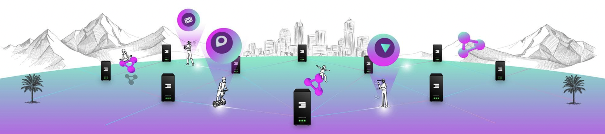

# Learn how to build the People's Internet

> No matter who you are or what you're creating, you can be part of the People's Internet. This library contains everything you need to start building using ThreeFold and paves the way for the future of the decentralized Internet.

The ThreeFold library describes the ThreeFold open source project, a peer-to-peer Internet infrastructure built from the ground up for scale. The different sub libraries cover key aspects of the infrastructure such as the [grid](@grid_home), [cloud](@cloud_home), [farming](@farming_intro), [TFT](@tokens_home), and the [technology](@technology) that connects it all together.  

<!-- ## Get started

The ThreeFold Grid consists of a new operating system, cloud, filesystem and planetary network. The full technology stack was designed to be compatible with (almost) all open source tools and protocols and it can run on most modern computers anywhere electricity and network is present.

| Technology | Description | Link |
| -----------| ----------- | -----|
| Zero-OS    | Operating System | 
 -->

## Disclaimer

All claims, content, designs, algorithms, estimates, roadmaps, specifications, and performance measurements described in this project are done with the author's best effort. It is up to the reader to check and validate their accuracy and truthfulness. Furthermore, nothing in this project constitutes a solicitation for investment.
