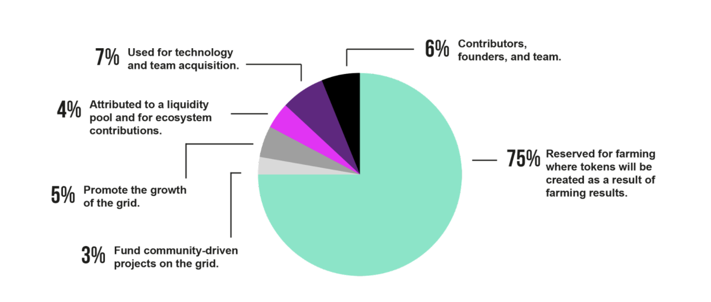

# ThreeFold Token Overview - Distribution

With a maximum amount of 4 billion TFT in circulation: 

- **75% reserved for farming**
  - Tokens are created as result of [Farming](@farming_intro).
    - Zero-OS measured capacity.
    - 3Nodes need to be connected and running.
    - Better than required SLA (Service Level Agreement).
  - Rewarded by means of code and verified by ThreeFold Chain - ThreeFold Blockchain (\*).
  - Rules as defined by Threefold Foundation but approved by the Wisdom_Council
  - Rules are different for Certified or DIY capacity. For now we only deliver DIY capacity.
- **3% for the funding of community driven contribution projects (max 160 million of TFT)**
  - See TGP
  - Grants needs to be approved by the Wisdom_Council.
- **5% for community & promotion effort**
  - Promote the growth of the ThreeFold Grid.
  - Budget needs approval from Wisdom_Council.
  - Large majority will be part of a vesting pool.
- **4% for liquidity pool & ecosystem contributions**
  - Tokens needed to grow on the exchange.
  - Tokens needed for ecosystem to let the tokens increase in value.
  - Budget needs approval from Wisdom_Council.
- **7% for Technology Acquisition + Starting Team (40 people)**
  - Original ThreeFold Cloud product (opensource)
  - Team who was working on this cloud project
- **6% for contributors, founders & team**
  - Part of vesting pool
  - Distribution needs approval from Wisdom_Council

> for Detailed Info see: [Stats Token Overview, info from TFT blockchain](stats_token_overview)

## TFT Marketcap

| Description                            | Value     |
| -------------------------------------- | --------- |
| Nr Liquid Tokens (May 5 2021)          | 276m      |
| Nr Total Tokens                        | 4000m     |
| TFT Marketcap if TFT price is 0.12 USD | 33m USD   |
| TFT Marketcap if TFT price is 0.15 USD | 41.4m USD |

Calculated May 5 2021

> Less than 7% will be liquid at [ThreeFold 3.0 Launch](threefold3_launch).

> WE ARE STILL IN PROCESS TO VEST TOKENS (MAY 2021)

## Remarks

!!!include:stats_toc
- [ThreeFold Token & Grid History](threefold_history)

!!!include:token_toc

!!!alias token_distribution,token_overview