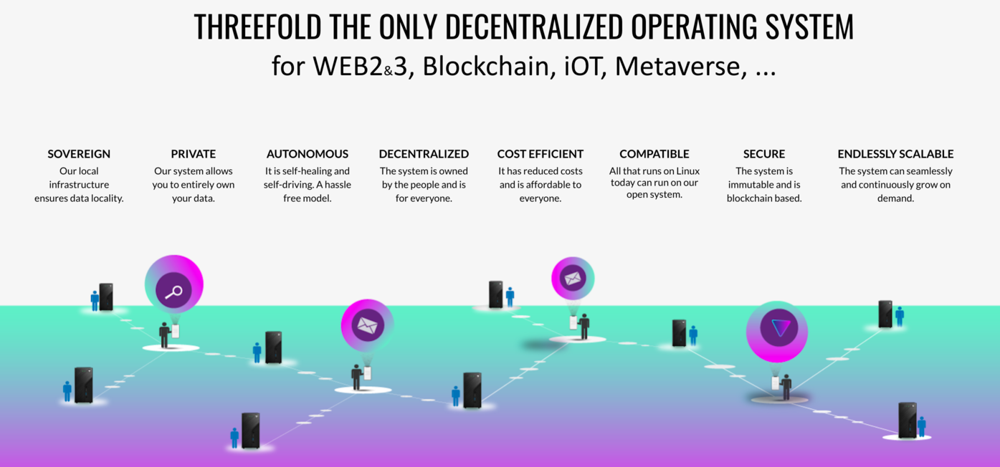

# What are ThreeFold Tokens (TFT)?

A TFT represents Internet Capacity (compute,storage,network) on the ThreeFold_Grid.

- Farmers create the TFT
- Users use the TFT

!!!include:utility_token_model

ThreeFold is the missing layer for Internet Capacity.

## What can I do with a TFT?

Users, developers, and enterprises need TFT to deploy their IT workloads on the TF Grid. Anything which runs on Linux is supported on the TFGrid.

## Where do TFTs come from?

When farmers connect 3Nodes to the [ThreeFold Grid](grid_intro), they farm (mine) and get rewarded with TFTs. Learn more about the farming/minting logic [here](farming_reward). While farmers keep on expanding the ThreeFold Grid, [the amount of tokens are limited](tft_limited_supply). This limit ensures stability of value and incentivization for all stakeholders.

> TFTs are created (minted) by the TFChain as a result of capacity being connected to the ThreeFold_Grid. 

This process is called **Farming**. [You can learn more about farming here](farming_intro).

## A circular token economy

A circular economy enables anyone to take part and to get rewarded for it: 
1. When Farmers connect 3Nodes and add capacity to the ThreeFold_Grid, they will create new TFT through the process of farming.  
2. Farmers can then exchange the farmed TFTs into other fiat or digital currencies on public exchanges. Also, this is where users can exchange fiat or digital currencies for TFTs.
3. Once they have TFTs in their wallets, users can use capacity on the Threefold_Grid. We call this process [utilization](utilization).

!!!include:token_toc