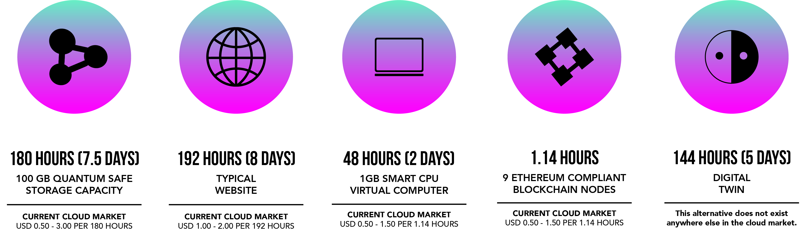

# What are ThreeFold Tokens?

A ThreeFold Token ("TFT") represets a unit of reservation of Internet Capacity (Compute, Storage and Network) and is the official medium of exchange on the ThreeFold Grid. TFT are created/minted by ThreeFold Farmers ("Farmers") while users buy and use them inside the ThreeFold ecosytem. 

## What can I do with a TFT?

Users, developers, and enterprises use TFT to reserve the capacity they need to create, use and share their data, IT workloads, and applications on the network. Moreover, with TFT, users will be able to use the different products and services deployed on the ThreeFold Grid. 

At the price of 0.20 U.S Dollars, one TFT can provide either of the following: 

## Where do TFTs come from?

When Farmers connect 3Nodes to the [ThreeFold Grid](grid_intro), they farm (mine) and get rewarded with TFTs. 

Learn more about Farming [here](@farming_intro).

Learn more about the Farming Reward [here](farming_reward).  

## A circular token economy

A circular economy enables anyone to take part in the solution and to get rewarded for it: 

1. When Farmers connect 3Nodes and add capacity to the ThreeFold_Grid, they will create new TFT through the process of Farming.  
2. Farmers can then exchange the farmed TFTs into other fiat or digital currencies on public exchanges. Also, this is where users can exchange fiat or digital currencies for TFTs.
3. Once they have TFTs in their wallets, users can use capacity on the Threefold_Grid. We call this process [utilization](utilization).

