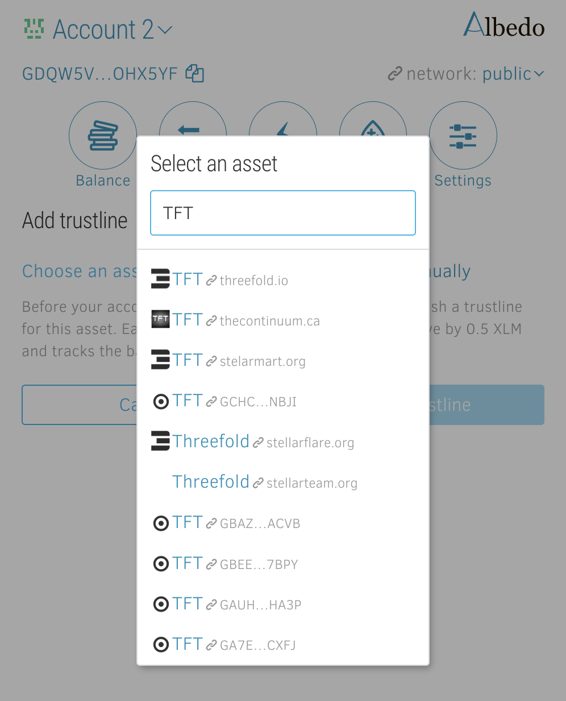

# Albedo Wallet

Albedo Wallet is an open-source browser-based (with browser add-on available) wallet from the creators of [stellar.expert](https://stellar.expert/) explorer.
It supports storage, swaps and liqudity pools participation. 

## Create Account
You can create a new account or import 24 word passphrase or secret key.

albedo-create-account.png

## Send and Receive funds 

In order to recieve funds you can copy use your address as shown in the top left corner. Click on "copy" button to copy it easier. 
In order to send funds, go to the Transfer dialog using menu button and fill in recipient address, amount and currency (tokens) to send. 

## Activate TFT or other currency/tokens

Please keep in mind, that on the stellar network you need to have some amount of XLM to cover transaction fees and also for any new asset you want to keep in your wallet, you have to add a trustline to it (activate).
To add a trustline, go to the "Balance" section, and click "Add trustline" button. 

Then click on "choose asset" and then type asset name. In case of TFT please make sure you also see a threefold.io website name nearby. 

## Swap assets

Albedo allows to easily swap assets between each other, using Stellar Dex on the background. 
If you want to swap assets, go to the "Swap" section, choose assets to swap between and select amount.
The exact price will be known after the operation so make sure that slippage tolerance is selected at the proper level for you.

## Liquidity Pools

Albedo allows to join [Stellar Dex Liquidity Pools](https://developers.stellar.org/docs/glossary/liquidity-pool/). 
By joining Liqudity pool, you engage your funds in helping community with liqudity and earn transaction fees whenever exchange is happening for the specific pair. 
To participate in the liquidity pool, you have to provide in equal proportions two assets from both side of the pair.
Click a button "Deposit liquidity to the pool" and then select amount of first or second asset you want to provide and click "Deposit". 

If you want to withdrwal liquidity from the pool, click on "Withdraw liqudity" button near the liquidity pair and select amount of the lqiudity you want to withdraw. 

