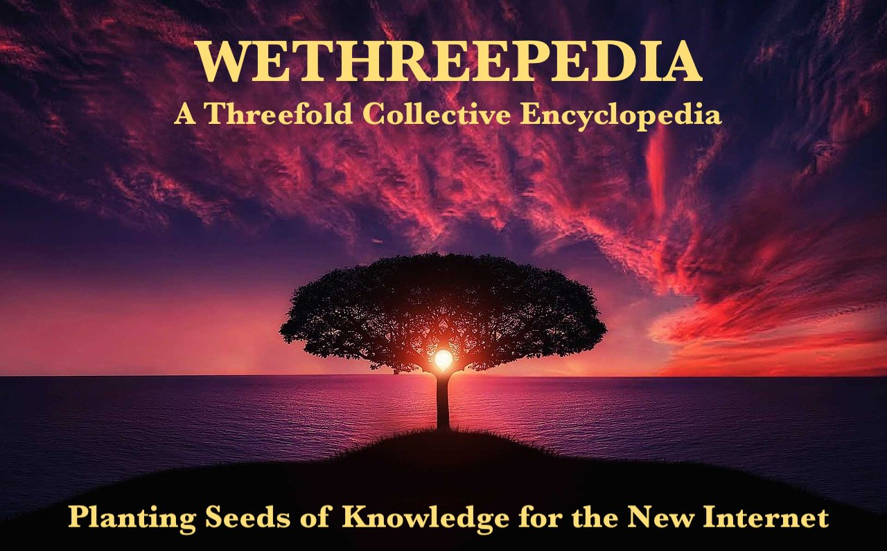
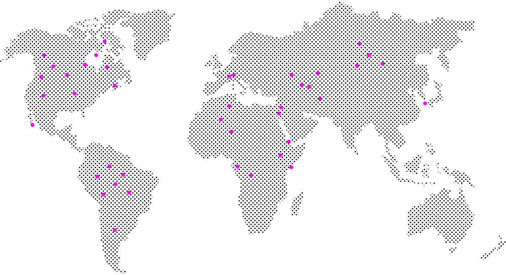

# Welcome to WeThreepedia... where knowledge and adventure unite.

    The goal is simple: learn and teach how to work and play with the Threefold Grid.

# Become a Threefold Farmer 
## Help to decentralize Internet and create a better world for everyone.

## You can buy a *plug n play* [Titan 3node](https://marketplace.3node.global/index.php?dispatch=categories.view&category_id=167) or build a [DIY 3node](/FAQ/FAQ.md#building-a-3node---steps-and-details).

Read the [Farming Documentation](/farming/farming.md).

Watch the amazing [3node DIY videos](https://www.youtube.com/user/floridanelson).

Read the [3node DIY Rack Server Guide](/3node_diy_rack_server/3node_diy_rack_server.md) to learn how to build a Threefold Rack Server.

Join the [Threefold Farming Community](https://t.me/threefoldfarmers).

***

# Use the Threefold Grid and Discover the New Internet

## Explore the myriad possibilities available on the Threefold Grid.

## It is up to you to discover the TF Grid and to contribute to the New Internet.

Read the [User FAQ](/faq/faq.md#user-faq).

Join the [Threefold Community](https://t.me/threefold).

***

# Become a Threefold Validator

## You can be a [validator](https://library.threefold.me/info/publishtools#/tfgrid/threefold__dao_executors_validators) on the [Layer 0](https://forum.threefold.io/c/dao/validators-signup-l0/84) or the [Layer 2](https://forum.threefold.io/c/dao/validators-signup-l2/83) of TF Chain.

## You can contribute directly to the security of the New Internet.

Read the [Validator FAQ](/faq/faq.md#validator-faq).

***

# Become a Threefold Developer

## There are many ways to develop and expand the great Threefold ecosystem.

## You can contribute to the growth and development of Threefold by becoming a developer.

Read the [Developer FAQ](/faq/faq.md#developer-faq).

Read the [Threefold Github](https://github.com/threefoldfoundation/).

Join the [Threefold Grid Tester Community](https://t.me/threefoldtesting).

***

# The Threefold Grid is currenly in more than 70 countries.

## Check for yourself on the [Threefold Explorer](https://explorerv3.grid.tf/). Composed of thousands of 3nodes, which are self-healing and quantum safe servers, the TF Grid is live and running all over the world. 

## The TF Grid is actually the biggest peer-to-peer compute network on the planet.

## The People’s Internet is formed by Farmers, independent people that connect 3Nodes to the ThreeFold Grid anywhere electricity and network is present. 

***

# Any Questions?

## [Read the FAQ](/faq/faq.md) and learn about this wonderful project.

## Ask the TF community on the [Threefold Telegram Channel](https://t.me/threefold).

